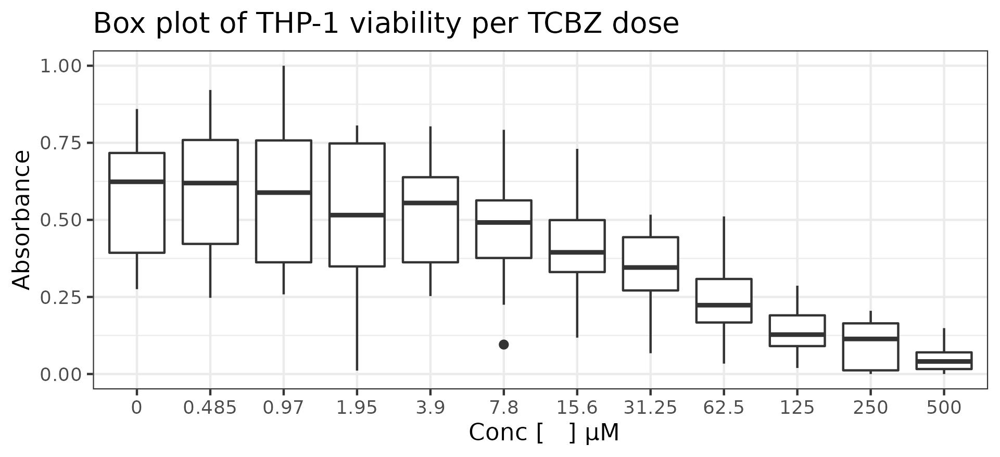
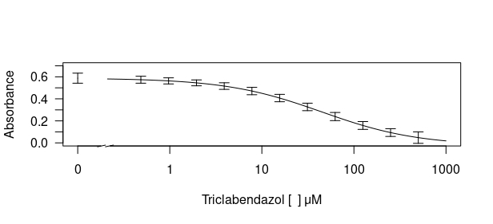
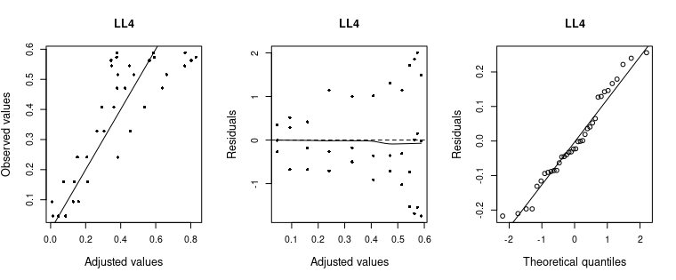

# Introduction

Drug repurposing is one of the most important strategies for saving time and money in the discovery of new therapies for neglected infectious diseases @nosengo_can_2016. Triclabendazole (TCBZ) is an approved drug to treat human fasciolosis and it has already shown antiproliferative activity against T. cruzi, T. brucei, and L. infantum @alberca_discovery_2016. More investigations about this drug in other parasites of the genus leishmania can elucidate if the TCBZ is a good candidate for the treatment of different kinds of leishmaniasis and test whether it has a synergistic effect to be implemented as an adjuvant to reduce the dose of toxic compounds already used to treat leishmaniasis. Cytotoxicity assays are one additional step performed in drug repurposing. It consists of a viability assay in a host cell model, such as THP-1 monocytes differentiated in macrophages. In the leishmaniasis context, this experiment provides a way to compare the selectivity of a compound to act on the parasite instead of the host cell @sundar_investigational_2015. The data used in this analysis corresponds to the results of viability assays to check the toxicity of TCBZ in THP-1 cells in the for further TCBZ repurposing evaluation for cutaneous leishmaniasis.

### **Goal**

The main goal in this analysis is to set a log-logistic model fit to THP-1 cells exposed to triclabendazol, calculate the half maximal inhibitory concentration (IC50) and use this result to identify the selectivity index of this drug for the parasites in further analysis.

## Methods

Viability assays using MTT (3-(4,5-dimethylthiazol-2-yl)-2,5- diphenyltetrazolium bromide) are the most common and simple form of in vitro test compounds @riss_cell_2004. MTT is a salt that is reduced form produces a colorimetric reaction that can be evaluated by absorbance. The reduction is proportional to viable cell mitochondria reduction activity. So, as a result of exposure to different compound concentrations, it is possible to fit a drug response curve and evaluate metrics of drug efficacy such as IC50.

Pharmacokinetics data are well fitted in nonlinear sigmoid models @khinkis_optimal_2003. The log-logistic 4 parameter model are commonly used because it easy interpretation, once that each parameter confers a biological meaning do the data "behaviour". The upper and lower asymptotes corresponds to θ1 and θ4, respectively while θ2 is the IC50 value and and θ3 the slope of the curve, as showed at the equation below. $$
  f (x|θ) = θ1 + \frac{θ1-θ4}
  {1 + 10^{θ3 (x−log_10_θ2 )}}
$$

# Data analysis

Raw data were composed of three independent experiment reads with 11 concentrations of triclabendazole and one control (cells without treatment) per plate. To each condition, in each plate, 8 technical replicates were obtained. After conversion the raw data into only one data frame in tyde data, the first step for exploratory data analysis were identify variables classes that composes the data frame and convert them to a more adequate manner to initiate the analysis. Absorbance values were scaled in a interval between 0 and 1 to facilitate data visualization. After that, all set of central tendencies measures and the standard deviation were visualized for each concentration of the drug. Two outliers were identified. Those removed measures corresponds to technical replicates and were highly discrepant, adressing a variance not necessarily given by the treatment. Because of this they were removed. Box plots were generated to summarizes all relevant information.

```{r, fig.cap="Figure 1. Box plot of THP-1 absorbance per triclabendazol dose.", fig.align = 'center'}
  
```

More variability is observed at the cells exposed to smaller levels of the drug. A common factor that impacts variability is the position of the treatments inside the plate, due to border effects. Border effects consists mainly in external noise induced by media evaporation and temperature variability @larsson_et_al_optimization_nodate in wells closest to plate border. Trying to identify if there were more variability on the wells positioned at the border, a score schema were seted up to all wells accordingly with their position in the plate (Figure 2). This attribution is given by PositionScore function accordingly with well position given by package plater.

```{r, out.width = "80%", fig.cap="Figure 2. Score per well position in the 96-well plate.", fig.align = 'center'}
knitr::include_graphics(path = "../figs/PositionScore.png") 
```

The following box plot shows the result of the variance in absorbance values per dose accordingly with wells position inside the plate. Due to unbalance its not possible to test or confirm if the variability in these case is due to border effect. However, for concentrations with observations for all positions scores, no tendency of higher variability on the border were observed.

```{r, out.width = "100%", fig.cap="Figure 3. Box plot of THP-1 absorbance per position score per dose.", fig.align = 'center'}
knitr::include_graphics(path = "../figs/02_MTT_tcbz_BP_PE.jpeg") 
```

# Model fit

Using DRC package @ritz_dose-response_2015, the summarized data were fitted to a 4 parameter log-logistic model (Figure 3). IC50 value were estimated at 46.750μM (p-value = 0.28410) with a 95% confidence interval between 12.83μM to -40.66μM and a 134.17μM of standard deviation.

```{r, out.width = "80%", fig.cap="Figure 4. Dose response curve of THP-1 to TCBZ.", fig.align = 'center'}

```

## Diagnosis

Residual analysis are essential to evaluate model fitness. Accordingly with the adjusted vs. observed plot, the model does not explain well the data, since we can observe a huge dispersion across the adjusted values line tendency. At residuals vs. adjusted values plot it is possible to confirm that there is a lack of homodecasticity in the data. Even thought, the quantile-quantile plot shows the normality assumption for non linear regression fit was respected.

```{r, out.width = "100%", fig.cap="Figure 5. Diagnosis of model fit.", fig.align = 'center'}

```

# Conclusions

Drug repurposing is one strategy to increase speed of treatment specially for neglected diseases such as Leishmaniasis. The main conclusions about the results obtained in this analyses require further experiments data about the effect of triclabendazole on Leishmania parasites (unavailable data). However the main conclusions about the analysis can be adressed. Higher fluctuation values are observed in wells exposed with low drug concentrations of the drug. This fluctuations are commonly attributed external to external causes, such as to border effects @larsson_et_al_optimization_nodate. These experiments were not design to test this effect, even thought, a preliminary analysis (box plot inclusion position score per treatment concentration) showed that there is no tendency of higher fluctuations on the border positions. Other factors, including intrinsicall noise of different traits of parasites under stress can bring on this results. Ideally, both hypothesis should be testes in further experiments. Using DRC package were possible to fit a four parameter log-logistic regression and estimete IC50. Residuals analysis showed that the data follows a normal distribuition, however pointed out a lack of fit in terms of observed vs. fitted values and heterocedastiity. Other models or methods probably can provide a better fit.

# References
