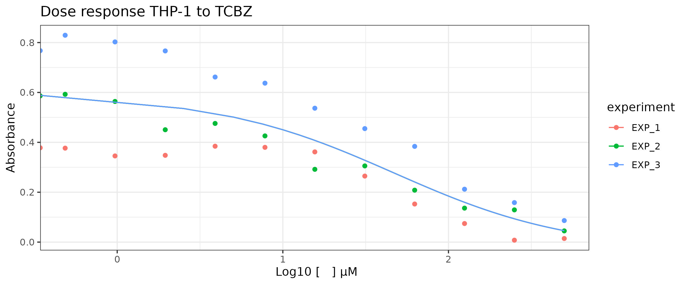

# Introduction

Drug repurposing is one of the most important strategies for saving time and money in the discovery of new therapies for neglected infectious diseases. Triclabendazole (TCBZ) is an approved drug to treat human fasciolosis and it has already shown antiproliferative activity against T. cruzi, T. brucei, and L. infantum. More investigations about this drug in other parasites of the genus leishmania can elucidate if the TCBZ is a good candidate for the treatment of different kinds of leishmaniasis and test whether it has a synergic effect to be implemented as an adjuvant to reduce the dose of toxic compounds already used to treat leishmaniasis.\
Cytotoxicity assays are one additional step performed in drug development and also in drug repurposing. It consists of a viability assay in a host cell model such as THP-1 monocytes differentiated in macrophages. This experiment provides a way to compare the selectivity of a compound to act on the parasite instead of the host cell. The data used in this evaluation corresponds to the results of viability assays to check the toxicity of TCBZ in THP-1 cells in the context of TCBZ repurposing evaluation for cutaneous leishmaniasis.

### Methods

Viability assays using MTT (3-(4,5-dimethylthiazol-2-yl)-2,5- diphenyltetrazolium bromide) are the most common and simple form of in vitro test compounds. MTT is a salt that is reduced form produces a colorimetric reaction that can be evaluated by absorbance. The reduction is proportional to viable cell mitochondria reduction activity. So, as a result of exposure to different compound concentrations, it is possible to fit a drug response curve and evaluate metrics of drug efficacy such as IC50 (half maximal inhibitory concentration). [write about seletivety index]

### Goal

The main goal in this analysis is to set a log-logistic model fit to THP-1 cells exposed to triclabendazol, calculate the IC50 and use this result to identify the selectivity index of this drug for the parasites. in future analysis.

## Data analysis

Raw data were composed of three independent experiment reads with 11 concentrations of triclabendazole and one control per plate. To each condition, in each plate 8 technical replicates were obtained. After conversion the raw data into only one data frame in tyde data (Script 01), the first step for exploratory data analysis were identify variables classes that composes the data frame and convert them to a more adequate manner to initiate the analysis. Absorbance values were scaled in a interval between 0 and 1 to facilitate data visualization. After that, all set of central tendencies measures and the standard deviation were visualized for each concentration of the drug. Two outliers were identified. Those removed measures corresponds to technical replicates and were highly discrepant, adressing a variance not necessarily given by the treatment. Because of this they were removed. Box plots were generated to summarizes all relevant information.

```{r}
  knitr::include_graphics("../figs/02_MTT_tcbz_BP.jpeg")
```

"Boxplot of absorbance values for all concentrations tested"

As observed, we have more variability at the cells exposed to smaller levels of the drug. One super common factor that impacts variability is the position of the treatments inside the plate, besause of border effects. Border effects consists maily in external noise induced by media evaporation and temperature variances. Trying to identify if there were more variabiliry on the wells positioned at the border, I choose to set up a score to the wells accordingly with their position in the plate ( figure ). This is given by the function PositionScore. The following boxplot shows the result of the variance in absorbance values per dose accordingly with wells position inside the plate. Unfortunetly,this data were not collected with this goal and bacause of its inbalance its not possible to test or confirm if the variability in these case is due to border effect. Howerver, for those concentrations with observations for all positions, no tendency of higher variabilities on the border were observed.

```{r}
knitr::include_graphics(path = "../figs/02_MTT_tcbz_BP_PE.jpeg",) 
```

# Model fit

Pharmacokinetics data re well fitted in nonlinear sigmoid models. The log-logistic 4 parameter model are commonly used because it easy interpretation, once that each parameter confers a biological meaning do the data "behaviour". Using DRC package the data were fitted to this model (Figure 3). IC50 value were estimated at 44.80μM (p-value = 0.00619) with a 95% confidence interval between 12.83μM to 76.78μM and a 16.24μM of standard deviation.

```{r}

```

## Diagnosis

Residual analysis are essential to evaluate model fitness. Accordingly with the adjusted x observed plot, the model does not explain well the data, since we can observe a lot of dispersion across the adjusted values line tendency. At residuals x adjusted values plot it ios possible to confirm that there is a lack of homodecasticity in the data. Even thought, the quantile-quantile plot shows the normality assumption for non linear regression fit was respected.

```{r}
knitr::include_graphics("../figs/03_Model_fit_diagnosis.jpeg")
```

# Conclusions

Drug repurposing is one to increase speed of treatment specially fos neglected diseases such as Leishmaniasis. The main conclusions about the results obtained in this analyses require futher data analysis about the effect of triclabendazole on Leishmania parasites (unavailabe data). However the main conclusions about the dara analysis can be adressed. Higher flutuationf values are observed in wells exposed with low drug concentrations of the drug. This flutuations are mainly attibuited to border effects. These experiments were not design to test this effect, even thought, a preliminar analysis (box plot includion position score per treatment concentration) showed that there is no tendency of higher fluctuations on the border positions. Other factors, incluiding intrinsical noise of diferent traits of parasites under stress can release this results. Ideally, both hypotesis should be testes in further experiments. Using DRC package were possible to fit a parameter log- logistic regression and estimete IC50. Residuals analysis showed that the data follows a normal distribuition, howerver pointed out a lack of fit in terms of observed vs. fitted values and heterocedastiity. Other models or methods probabily can provide a better fit.

# References
